# ms-order and ms-history

<h2> Informações</h2>
Os microserviços <strong>Order</strong> e <strong>History</strong> podem ser rodados de maneira individual, porém para o endpoint <strong>CRIAR</strong> do <strong>Order</strong> às duas aplicações + o <strong>Kafka</strong> precisam estar "startados". 

Projetos de microserviços <strong>Order</strong> e <strong>History</strong>, as tecnologias usadas nesses
projetos foram:
<ul>
  <li><strong>Spring Boot</strong></li>
  <li><strong>Docker</strong></li>
  <li><strong>Kafka</strong></li>
  <li><strong>Model Mapper</strong></li>
  <li><strong>Lombok</strong></li>
  <li><strong>MongoDB</strong></li>
  <li><strong>MYSQL</strong></li>
  <li><strong>Flyway</strong></li>
  <li><strong>Postman</strong></li>
</ul>

<h3> Temos na pasta docker o arquivo docker-compose.yaml para poder rodar o Kafka e fazer a comunicação entre os dois microserviços </h3>

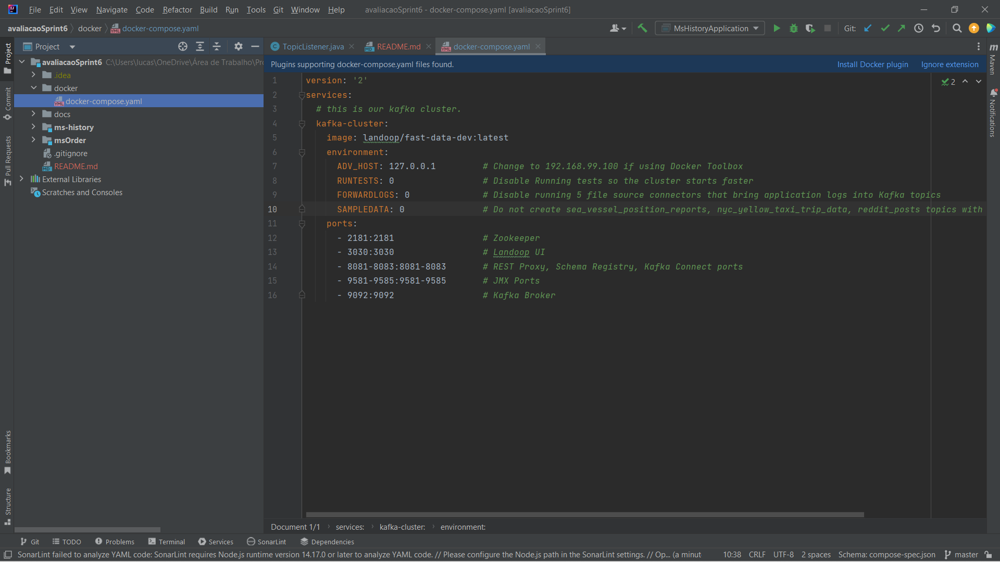

<h3> A arquitetura de ambos projetos é a hexagonal </h3>

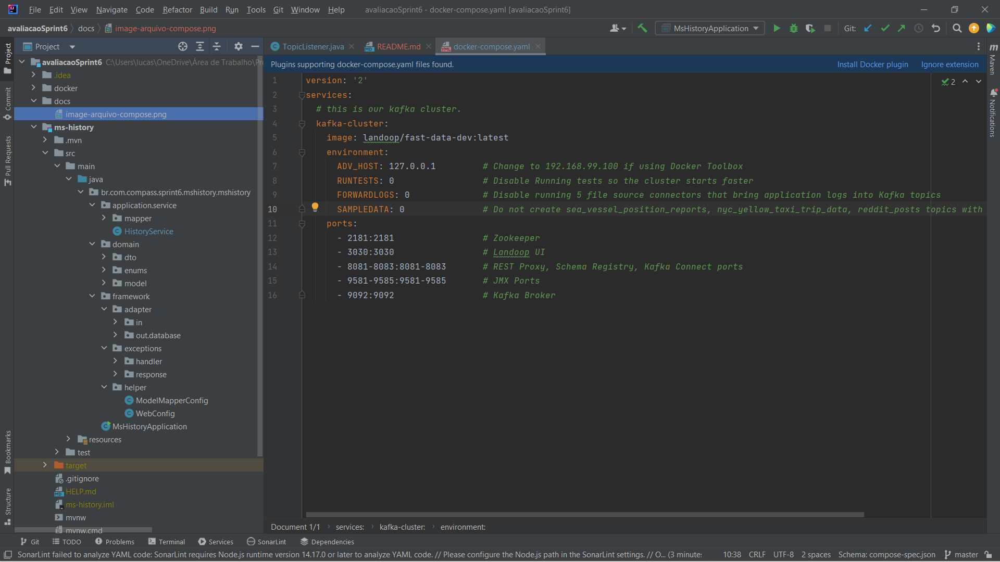

<h2>ms - order</h2>

<h3> O ms-order é o microserviço producer, ele possui classes de serviços de ITEM, ORDER e ADDRESS, incluindo as classes de serialização, nele é utilizado a Api Viacep e possui o TopicProducer</h3>

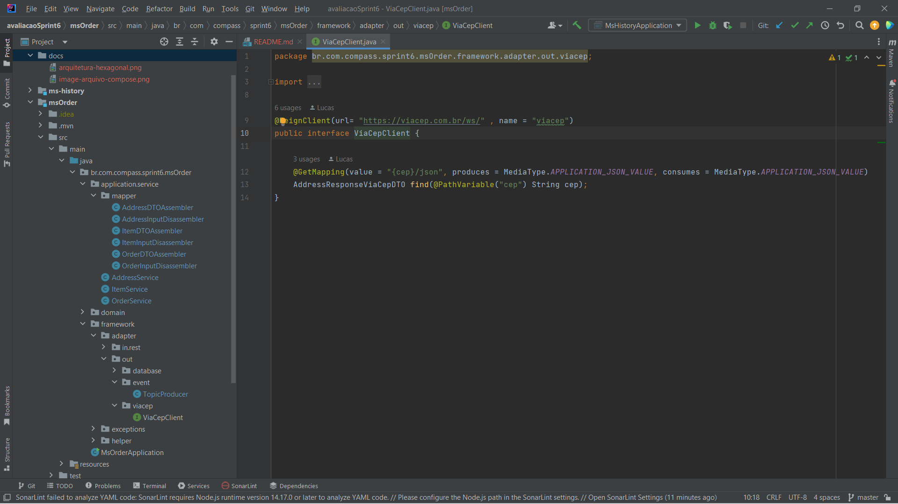

<h3>Postman</h3>

<h3>Listar</h3>
<p>Podendo filtrar por <strong>cpf</strong> e por maior valor (atenção na pesquisa por <strong>cpf</strong>, ela precisa ser igual ao cadastrado).</p>

````text
cURL: curl --location --request GET 'http://localhost:8080/api/pedidos/'
````

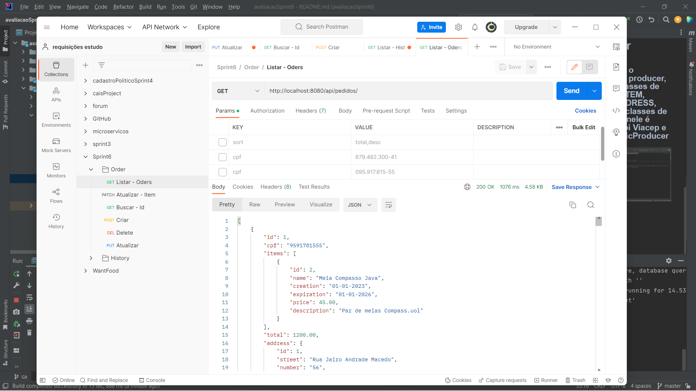

<h4>Response:</h4>

```json
{
"id": 1,
"cpf": "9591781555",
"items": [
{
"id": 2,
"name": "Meia Compasso Java",
"creation": "26-02-2002",
"expiration": "01-01-2026",
"price": 45.00,
"description": "Par de meias Compass.uol"
}
],
"total": 45.00,
"address": {
"id": 1,
"street": "Rua Jairo Andrade Macedo",
"number": "56",
"neighborhood": "São Conrado",
"city": "Aracaju",
"state": "SE",
"cep": "49042-480"
}
}
```

<h3>Buscar</h3>
<p>Caso o <strong>ID</strong> não exista, retornará <strong>404 - not found</strong>.</p>

````text
cURL: curl --location --request GET 'http://localhost:8080/api/pedidos/1'
````

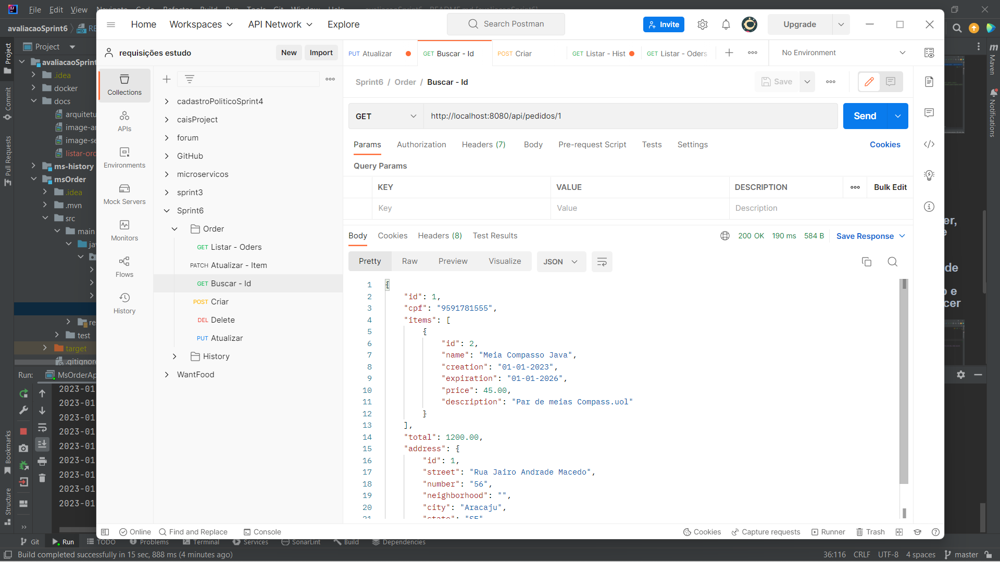

<h3>Deletar</h3>
<p>Caso o <strong>ID</strong> não exista, retornará <strong>404 - not found</strong> como na imagem abaixo, se existir retornará <strong>204 - no content</strong>.</p>

````text
cURL: curl --location --request DELETE 'http://localhost:8080/api/pedidos/12'
````

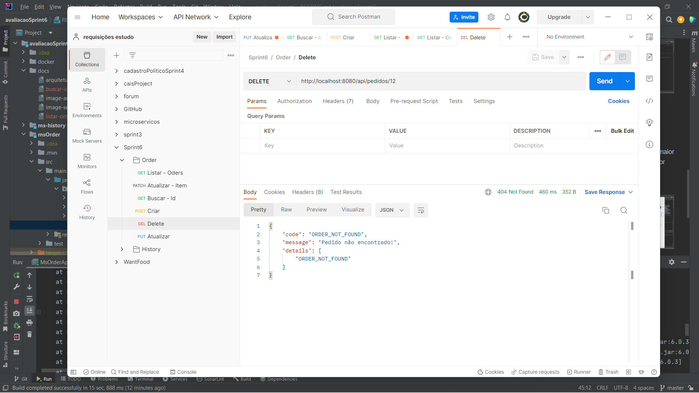

<h3>Patch - items</h3>
<p>Caso algum campo for violado, retornará uma mensagem de erro, informando o campo que está inválido e se o ID não existir retornará <strong>404 not
found</strong> com uma mensagem de erro.</p>
<p>Esse endpoint nos permite alterar um ou vários atributos do objeto <strong>Item</strong>.</p>

````text
cURL: curl --location --request PATCH 'http://localhost:8080/api/itens/2' \
--header 'Content-Type: application/json' \
--data-raw '
{
    "creation": "26-02-2002"
}'
````

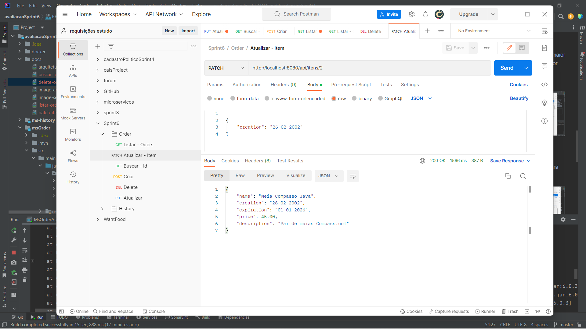

<h3>Atualizar</h3>
<p>Caso algum campo for violado, retornará uma mensagem de erro, informando o campo que está inválido e se o <strong>ID</strong> não existir retornará <strong>404 not found</strong> com uma mensagem de erro.</p>
<p>Esse endpoint nos permite alterar apenas <strong>cpf, total e o objeto address</strong>.</p>

````text
cURL: curl --location --request PUT 'http://localhost:8080/api/pedidos/2' \
--header 'Content-Type: application/json' \
--data-raw ' {
        "cpf": "095.917.815-55",
        "total": 5663.00,
        "address": {
            "street": "Rua Jairo Andrade Macedo",
            "number": "56",
            "neighborhood": "São Conrado",
            "city": "Aracaju",
            "state": "SE",
            "cep": "49042-480"
        }
    }'
````

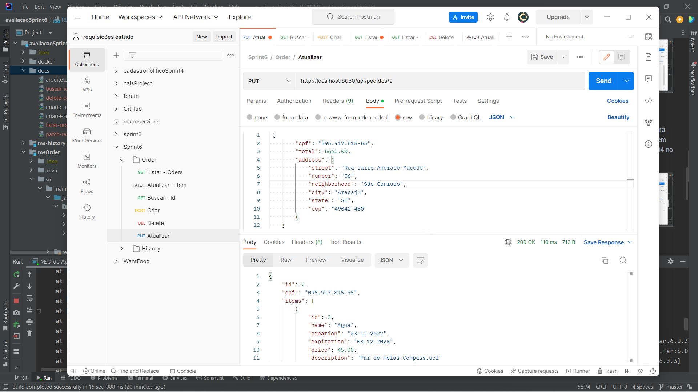

<h3>Criar</h3>
<p>Caso algum campo for violado, retornará uma mensagem de erro, informando o campo que está inválido.</p>
<p>Para esse endpoint é preciso está com o <strong>Kafka</strong> rodando no <strong>Docker</strong> e subir também o <strong>ms-history</strong>.</p>
<p>A data estará como null porque ela é preenchida quando é salva no <strong>Mongdb</strong>.</p>

````text
cURL: curl --location --request POST 'http://localhost:8080/api/pedidos/' \
--header 'Content-Type: application/json' \
--data-raw ' {
        "cpf": "095.917.815-55",
        "items": [
            {
                "name": "Agua",
                "creation": "03-12-2022",
                "expiration": "03-12-2026",
                "price": 15.00,
                "description": "Par de meias Compass.uol"
            },
            {
                "name": "Agua",
                "creation": "03-12-2022",
                "expiration": "11-02-2026",
                "price": 45.00,
                "description": "Par de meias Compass.uol"
            }
        ],
        "address": {
            "cep": "40430-390",
            "number": "9A"
        }
    }'
````

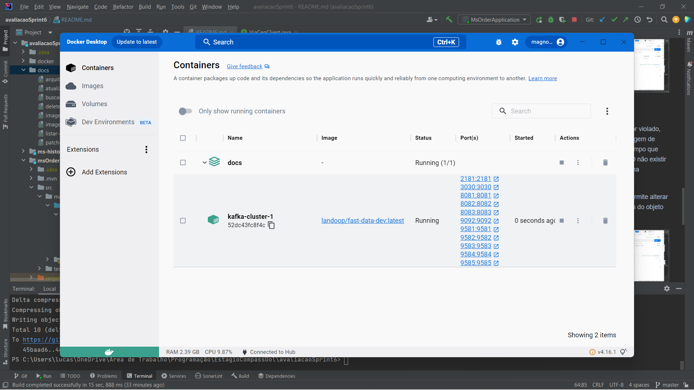
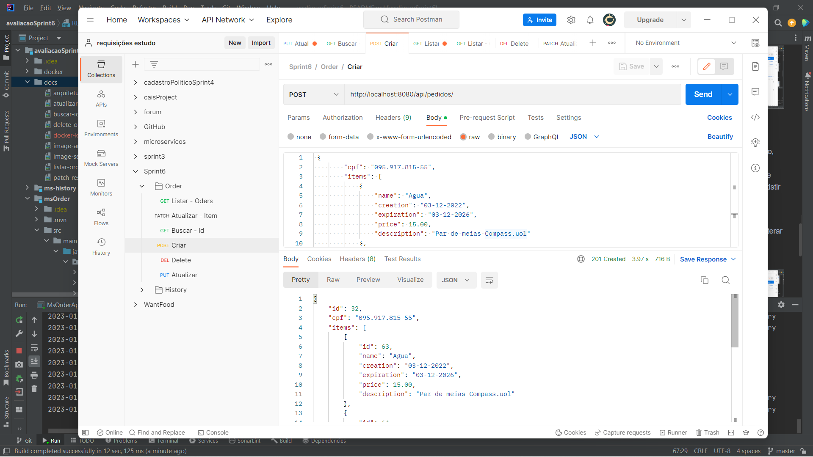
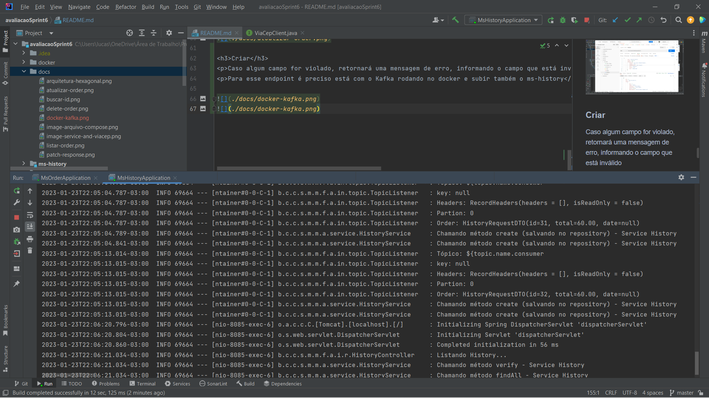

<h2>ms - history</h2>

<h3> O ms-history é o microserviço consumer</h3>

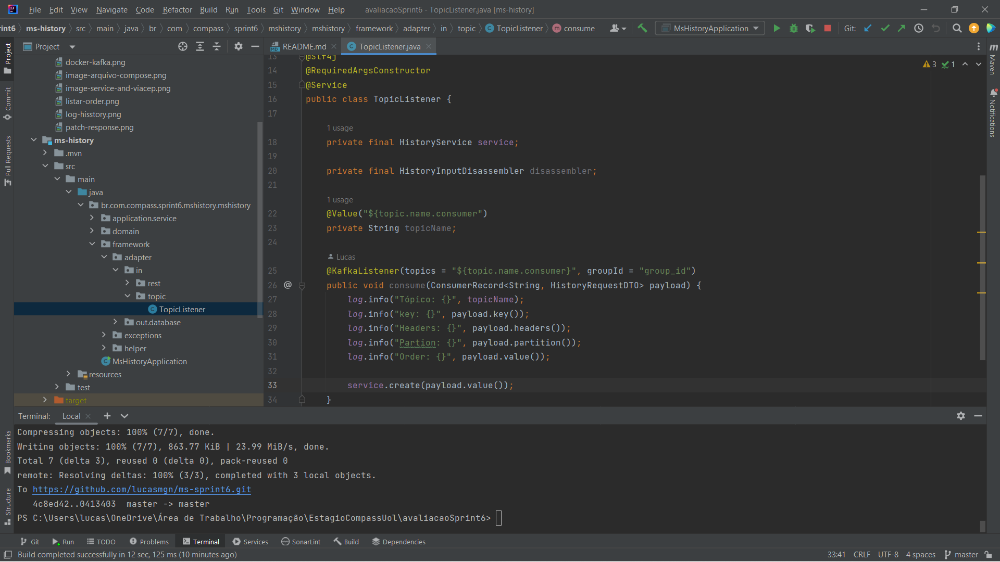

<h3>Postman</h3>

<h3>Listar</h3>
<p>Listagem ocorre na ordem <i><strong>cronológica inversa</strong></i>, ou seja, listará do mais recente até o mais antigo, também possui o filtro entre duas datas,<strong><i> trazendo apenas as histories das datas entre elas</i></strong>.</p>

````text
cURL: curl --location --request GET 'http://localhost:8085/api/history/'
````

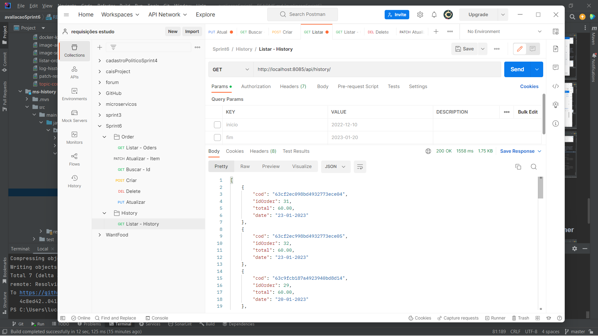

<p>Listando history com filtro de data inicio e fim.</p>

````text
cURL: curl --location --request GET 'http://localhost:8085/api/history/?inicio=2022-12-13&fim=2023-01-24'
````

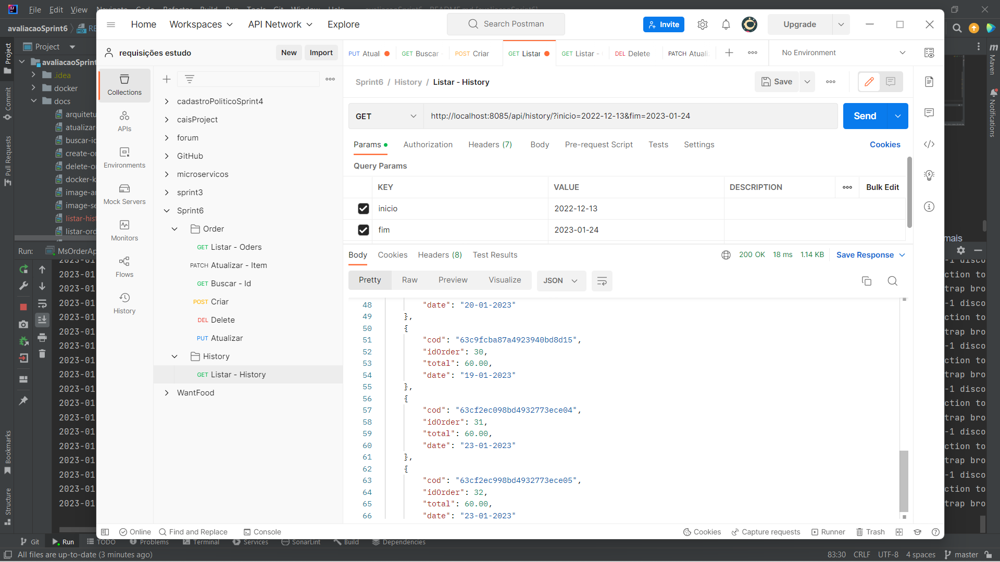

<h4>Response:</h4>

```json
{
  "cod": "63c94e69cd8ff26bfb3fe67c",
  "idOrder": 26,
  "total": 60.00,
  "date": "19-01-2023"
},
{
"cod": "63c9fcb187a4923940bd8d14",
"idOrder": 29,
"total": 60.00,
"date": "20-01-2023"
},
{
"cod": "63c9fcba87a4923940bd8d15",
"idOrder": 30,
"total": 60.00,
"date": "19-01-2023"
},
{
"cod": "63cf2ec098bd4932773ece04",
"idOrder": 31,
"total": 60.00,
"date": "23-01-2023"
},
{
"cod": "63cf2ec998bd4932773ece05",
"idOrder": 32,
"total": 60.00,
"date": "23-01-2023"
}
```